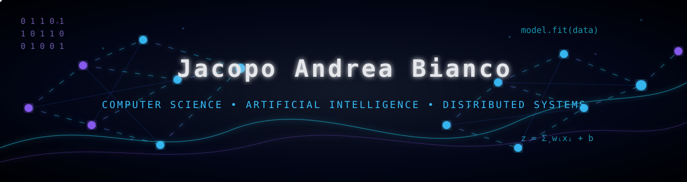

  

# Hi, I'm Jacopo 👋

Computer Science student at the University of Pisa.

I'm interested in Artificial Intelligence, Machine Learning and distributed systems. I enjoy building software that combines algorithms, networking and concurrency, and I'm always looking for opportunities to work on research-oriented projects.

### Technologies

### Featured Projects

📌 **IMDb Actor Graph & Shortest Paths**  
Large-scale graph construction and shortest-path search on IMDb collaboration networks.

📌 **Connections Multiplayer Game**  
Distributed client-server implementation of the NYT Connections game using Java NIO, TCP and UDP.

### Connect

